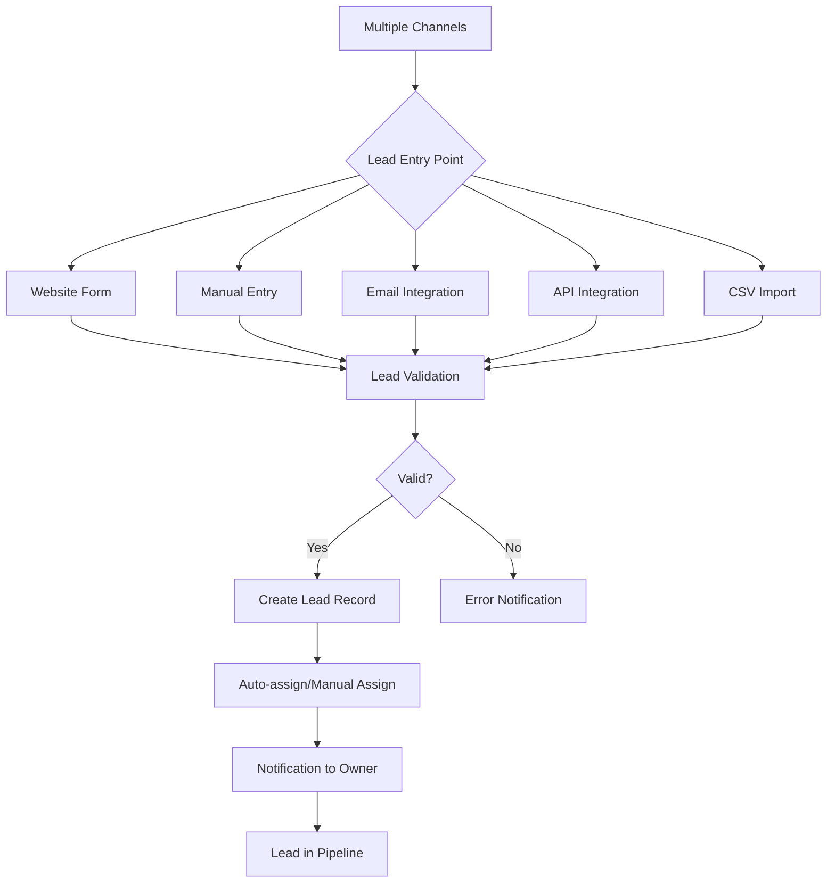
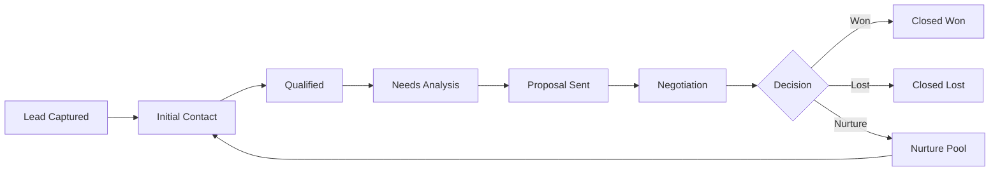
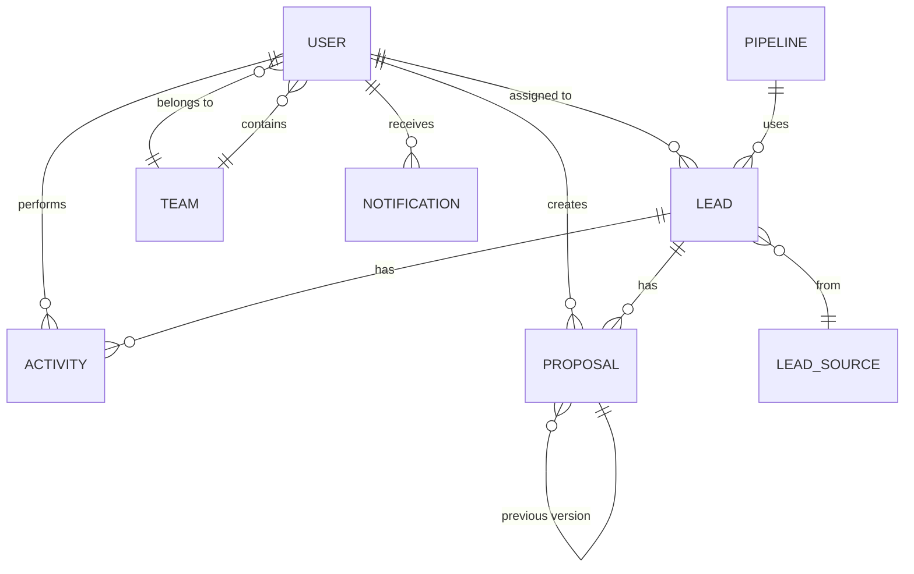

# ThinkTanker Lead Management System - Architecture Document

## 1. System Overview

A comprehensive Lead Generation + Lead Management system designed for ThinkTanker's BDM and Sales teams to capture, track, follow up, and convert leads from multiple channels.

---

## 2. Complete Flow Design

### 2.1 Lead Capture Flow



### 2.2 Lead Management Flow



### 2.3 User Roles & Permissions

| Role | Permissions |
|------|-------------|
| **Admin** | Full access: manage users, view all leads, configure system, reports |
| **Sales Manager** | View all team leads, assign leads, reports, manage team members |
| **BDM/Sales Rep** | View/edit assigned leads, create leads, update status, add notes |
| **Marketing** | Create leads, view lead sources, campaign performance |

---

## 3. Data Model Design

### 3.1 Core Entities

#### **Lead**
```typescript
{
  _id: ObjectId,
  leadNumber: string,              // Auto-generated: LD-2025-0001
  
  // Contact Information
  firstName: string,
  lastName: string,
  email: string,
  phone: string,
  alternatePhone?: string,
  company: string,
  designation?: string,
  website?: string,
  
  // Lead Details
  source: enum,                     // Website, Referral, Cold Call, LinkedIn, etc.
  sourceDetails?: string,           // Campaign name, referrer, etc.
  status: enum,                     // Lead Captured, Initial Contact, Qualified, etc.
  lifecycleStage: enum,             // New, Contacted, Qualified, Opportunity, Customer
  priority: enum,                   // Hot, Warm, Cold
  
  // Business Information
  industry?: string,
  companySize?: enum,               // 1-10, 11-50, 51-200, 201-500, 500+
  location: {
    city?: string,
    state?: string,
    country: string
  },
  
  // Opportunity Details
  serviceInterest: string[],        // Web Dev, Mobile App, Cloud, AI/ML, etc.
  budget?: {
    min: number,
    max: number,
    currency: string
  },
  dealValue?: number,
  expectedCloseDate?: Date,
  
  // Assignment & Ownership
  assignedTo?: ObjectId,            // User reference
  createdBy: ObjectId,              // User reference
  teamId?: ObjectId,                // Team reference
  
  // Tracking
  lastContactedDate?: Date,
  nextFollowUpDate?: Date,
  followUpCount: number,
  
  // Engagement Score
  engagementScore?: number,         // 0-100 based on interactions
  
  // Metadata
  tags: string[],
  customFields?: Map<string, any>,
  
  // Audit
  createdAt: Date,
  updatedAt: Date,
  convertedAt?: Date,
  closedAt?: Date,
  lostReason?: string
}
```

#### **Activity/Interaction**
```typescript
{
  _id: ObjectId,
  leadId: ObjectId,
  userId: ObjectId,                 // Who performed the activity
  
  type: enum,                       // Call, Email, Meeting, Note, Task, Status Change
  subject?: string,
  description: string,
  
  // Call/Meeting specific
  duration?: number,                // in minutes
  outcome?: enum,                   // Successful, No Answer, Voicemail, etc.
  
  // Email specific
  emailSent?: boolean,
  emailOpened?: boolean,
  emailClicked?: boolean,
  
  // Task specific
  dueDate?: Date,
  completed?: boolean,
  completedAt?: Date,
  
  // Attachments
  attachments?: [{
    fileName: string,
    fileUrl: string,
    fileType: string,
    uploadedAt: Date
  }],
  
  createdAt: Date,
  updatedAt: Date
}
```

#### **User**
```typescript
{
  _id: ObjectId,
  
  // Authentication
  email: string,
  password: string,                 // hashed
  
  // Profile
  firstName: string,
  lastName: string,
  phone?: string,
  avatar?: string,
  
  // Role & Access
  role: enum,                       // Admin, Manager, BDM, Marketing
  status: enum,                     // Active, Inactive, Suspended
  
  // Team
  teamId?: ObjectId,
  managerId?: ObjectId,
  
  // Performance Tracking
  leadsAssigned: number,
  leadsConverted: number,
  conversionRate: number,
  totalRevenue: number,
  
  // Settings
  emailNotifications: boolean,
  smsNotifications: boolean,
  timezone: string,
  
  // Audit
  lastLogin?: Date,
  createdAt: Date,
  updatedAt: Date
}
```

#### **Team**
```typescript
{
  _id: ObjectId,
  name: string,
  description?: string,
  managerId: ObjectId,
  members: ObjectId[],
  
  // Performance
  totalLeads: number,
  convertedLeads: number,
  teamRevenue: number,
  
  createdAt: Date,
  updatedAt: Date
}
```

#### **LeadSource**
```typescript
{
  _id: ObjectId,
  name: string,
  type: enum,                       // Organic, Paid, Referral, Direct
  isActive: boolean,
  
  // Tracking
  totalLeads: number,
  convertedLeads: number,
  conversionRate: number,
  cost?: number,
  roi?: number,
  
  createdAt: Date,
  updatedAt: Date
}
```

#### **EmailTemplate**
```typescript
{
  _id: ObjectId,
  name: string,
  subject: string,
  body: string,                     // HTML content with placeholders
  category: enum,                   // Welcome, Follow-up, Proposal, etc.
  isActive: boolean,
  
  createdBy: ObjectId,
  createdAt: Date,
  updatedAt: Date
}
```

#### **Pipeline**
```typescript
{
  _id: ObjectId,
  name: string,
  stages: [{
    name: string,
    order: number,
    probability: number,            // % chance of conversion
    color: string
  }],
  isDefault: boolean,
  
  createdAt: Date,
  updatedAt: Date
}
```

#### **Proposal**
```typescript
{
  _id: ObjectId,
  proposalNumber: string,           // Auto-generated: PROP-2025-0001
  
  // References
  leadId: ObjectId,
  createdBy: ObjectId,
  
  // Basic Information
  title: string,
  clientName: string,
  clientEmail: string,
  clientCompany: string,
  
  // Proposal Details
  status: enum,                     // Draft, Sent, Viewed, Accepted, Rejected, Expired
  validUntil: Date,
  
  // Content Sections
  executiveSummary?: string,
  problemStatement?: string,
  proposedSolution: string,
  scopeOfWork: string,
  
  // Pricing
  items: [{
    itemId: string,
    name: string,
    description?: string,
    quantity: number,
    unitPrice: number,
    discount?: number,
    tax?: number,
    total: number
  }],
  
  pricing: {
    subtotal: number,
    discount: number,
    discountType: enum,             // Percentage, Fixed
    tax: number,
    taxRate: number,
    total: number,
    currency: string
  },
  
  // Timeline
  deliveryTimeline?: string,
  milestones?: [{
    name: string,
    description?: string,
    duration: string,
    deliverables: string[]
  }],
  
  // Terms & Conditions
  paymentTerms?: string,
  termsAndConditions?: string,
  
  // Tracking
  sentAt?: Date,
  viewedAt?: Date,
  viewCount: number,
  acceptedAt?: Date,
  rejectedAt?: Date,
  rejectionReason?: string,
  
  // Files
  pdfUrl?: string,
  attachments?: [{
    fileName: string,
    fileUrl: string,
    fileType: string,
    uploadedAt: Date
  }],
  
  // Versioning
  version: number,
  previousVersionId?: ObjectId,
  
  // Metadata
  notes?: string,
  customFields?: Map<string, any>,
  
  // Audit
  createdAt: Date,
  updatedAt: Date
}
```

#### **Report/Analytics**
```typescript
{
  _id: ObjectId,
  type: enum,                       // Daily, Weekly, Monthly, Custom
  dateRange: {
    from: Date,
    to: Date
  },
  
  metrics: {
    totalLeads: number,
    newLeads: number,
    convertedLeads: number,
    lostLeads: number,
    conversionRate: number,
    averageDealValue: number,
    totalRevenue: number,
    
    // By source
    bySource: Map<string, number>,
    
    // By user
    byUser: Map<ObjectId, {
      leads: number,
      converted: number,
      revenue: number
    }>,
    
    // By stage
    byStage: Map<string, number>
  },
  
  generatedBy: ObjectId,
  generatedAt: Date
}
```

---

## 4. API Structure

### 4.1 Authentication & Authorization

```
POST   /api/auth/register          - Register new user (Admin only)
POST   /api/auth/login             - Login
POST   /api/auth/logout            - Logout
POST   /api/auth/refresh-token     - Refresh JWT token
POST   /api/auth/forgot-password   - Request password reset
POST   /api/auth/reset-password    - Reset password
GET    /api/auth/me                - Get current user profile
PUT    /api/auth/profile           - Update profile
PUT    /api/auth/change-password   - Change password
```

### 4.2 Lead Management

```
GET    /api/leads                  - Get all leads (with filters, pagination)
GET    /api/leads/:id              - Get single lead
POST   /api/leads                  - Create new lead
PUT    /api/leads/:id              - Update lead
DELETE /api/leads/:id              - Delete lead (soft delete)
PATCH  /api/leads/:id/status       - Update lead status
PATCH  /api/leads/:id/assign       - Assign lead to user
POST   /api/leads/bulk-import      - Import leads from CSV
GET    /api/leads/export           - Export leads to CSV
GET    /api/leads/my-leads         - Get leads assigned to current user
GET    /api/leads/team-leads       - Get team leads (Manager)
```

### 4.3 Activities/Interactions

```
GET    /api/leads/:leadId/activities        - Get all activities for a lead
POST   /api/leads/:leadId/activities        - Create new activity
PUT    /api/activities/:id                  - Update activity
DELETE /api/activities/:id                  - Delete activity
GET    /api/activities/upcoming             - Get upcoming tasks/follow-ups
POST   /api/leads/:leadId/activities/call   - Log a call
POST   /api/leads/:leadId/activities/email  - Log an email
POST   /api/leads/:leadId/activities/note   - Add a note
POST   /api/leads/:leadId/activities/task   - Create a task
```

### 4.4 User Management

```
GET    /api/users                  - Get all users (Admin/Manager)
GET    /api/users/:id              - Get user details
POST   /api/users                  - Create user (Admin)
PUT    /api/users/:id              - Update user
DELETE /api/users/:id              - Delete user (soft delete)
PATCH  /api/users/:id/status       - Activate/Deactivate user
GET    /api/users/:id/performance  - Get user performance metrics
```

### 4.5 Team Management

```
GET    /api/teams                  - Get all teams
GET    /api/teams/:id              - Get team details
POST   /api/teams                  - Create team
PUT    /api/teams/:id              - Update team
DELETE /api/teams/:id              - Delete team
POST   /api/teams/:id/members      - Add member to team
DELETE /api/teams/:id/members/:userId - Remove member from team
GET    /api/teams/:id/performance  - Get team performance
```

### 4.6 Lead Sources

```
GET    /api/lead-sources           - Get all lead sources
POST   /api/lead-sources           - Create lead source
PUT    /api/lead-sources/:id       - Update lead source
DELETE /api/lead-sources/:id       - Delete lead source
GET    /api/lead-sources/:id/stats - Get source statistics
```

### 4.7 Email Templates

```
GET    /api/email-templates        - Get all templates
GET    /api/email-templates/:id    - Get template
POST   /api/email-templates        - Create template
PUT    /api/email-templates/:id    - Update template
DELETE /api/email-templates/:id    - Delete template
POST   /api/email-templates/:id/send - Send email using template
```

### 4.8 Analytics & Reports

```
GET    /api/analytics/dashboard    - Get dashboard metrics
GET    /api/analytics/leads        - Lead analytics
GET    /api/analytics/conversion   - Conversion funnel
GET    /api/analytics/revenue      - Revenue analytics
GET    /api/analytics/sources      - Source performance
GET    /api/analytics/users        - User performance
GET    /api/analytics/trends       - Trend analysis
POST   /api/reports/generate       - Generate custom report
GET    /api/reports/:id            - Get saved report
```

### 4.9 Notifications

```
GET    /api/notifications          - Get user notifications
PATCH  /api/notifications/:id/read - Mark as read
PATCH  /api/notifications/read-all - Mark all as read
DELETE /api/notifications/:id      - Delete notification
```

### 4.10 Settings

```
GET    /api/settings               - Get system settings
PUT    /api/settings               - Update settings (Admin)
GET    /api/settings/pipelines     - Get pipeline configurations
POST   /api/settings/pipelines     - Create pipeline
PUT    /api/settings/pipelines/:id - Update pipeline
```

### 4.11 Proposal Management

```
GET    /api/proposals              - Get all proposals (with filters, pagination)
GET    /api/proposals/:id          - Get single proposal
POST   /api/proposals              - Create new proposal
PUT    /api/proposals/:id          - Update proposal
DELETE /api/proposals/:id          - Delete proposal (soft delete)
PATCH  /api/proposals/:id/status   - Update proposal status
POST   /api/proposals/:id/send     - Send proposal to client
GET    /api/proposals/:id/preview  - Preview proposal
GET    /api/proposals/:id/pdf      - Generate/Download PDF
POST   /api/proposals/:id/duplicate - Duplicate proposal
POST   /api/proposals/:id/accept   - Accept proposal (client action)
POST   /api/proposals/:id/reject   - Reject proposal (client action)
GET    /api/proposals/lead/:leadId - Get all proposals for a lead
GET    /api/proposals/my-proposals - Get proposals created by current user
POST   /api/proposals/:id/version  - Create new version
GET    /api/proposals/:id/versions - Get all versions of a proposal
```

---

## 5. Database Structure (MongoDB)

### 5.1 Collections

```
- users
- teams
- leads
- activities
- leadSources
- emailTemplates
- pipelines
- proposals
- notifications
- reports
- systemSettings
- auditLogs
```

### 5.2 Indexes

```javascript
// users collection
db.users.createIndex({ email: 1 }, { unique: true })
db.users.createIndex({ role: 1, status: 1 })
db.users.createIndex({ teamId: 1 })

// leads collection
db.leads.createIndex({ email: 1 })
db.leads.createIndex({ phone: 1 })
db.leads.createIndex({ leadNumber: 1 }, { unique: true })
db.leads.createIndex({ status: 1, assignedTo: 1 })
db.leads.createIndex({ createdAt: -1 })
db.leads.createIndex({ assignedTo: 1, status: 1 })
db.leads.createIndex({ source: 1 })
db.leads.createIndex({ nextFollowUpDate: 1 })
db.leads.createIndex({ company: 1 })
db.leads.createIndex({ tags: 1 })

// activities collection
db.activities.createIndex({ leadId: 1, createdAt: -1 })
db.activities.createIndex({ userId: 1, type: 1 })
db.activities.createIndex({ dueDate: 1, completed: 1 })

// teams collection
db.teams.createIndex({ managerId: 1 })

// proposals collection
db.proposals.createIndex({ proposalNumber: 1 }, { unique: true })
db.proposals.createIndex({ leadId: 1, createdAt: -1 })
db.proposals.createIndex({ createdBy: 1, status: 1 })
db.proposals.createIndex({ status: 1, validUntil: 1 })
db.proposals.createIndex({ createdAt: -1 })

// notifications collection
db.notifications.createIndex({ userId: 1, read: 1, createdAt: -1 })
```

### 5.3 Sample Data Relationships



---

## 6. UI Modules Design

### 6.1 Admin Panel Modules

#### **Dashboard**
- **Key Metrics Cards**
  - Total Leads (with trend)
  - Conversion Rate
  - Revenue This Month
  - Active Users
  
- **Charts & Visualizations**
  - Lead funnel chart
  - Revenue trend (line chart)
  - Leads by source (pie chart)
  - Team performance comparison (bar chart)
  
- **Recent Activities**
  - Latest lead captures
  - Recent conversions
  - Upcoming follow-ups

#### **Lead Management**
- **Lead List View**
  - Advanced filters (status, source, assigned to, date range, tags)
  - Bulk actions (assign, export, delete)
  - Quick search
  - Column customization
  - Pagination
  
- **Kanban Board View**
  - Drag-and-drop between stages
  - Lead cards with key info
  - Stage-wise count
  - Quick actions on cards
  
- **Lead Detail Page**
  - Contact information section
  - Lead details & opportunity info
  - Activity timeline
  - Quick actions (call, email, task, note)
  - Related documents/attachments
  - Status change history
  
- **Add/Edit Lead Form**
  - Multi-step form (Contact → Details → Opportunity)
  - Auto-complete for company
  - Duplicate detection
  - Custom fields support

#### **User Management**
- User list with roles
- Add/Edit user form
- User performance dashboard
- Activate/Deactivate users
- Reset password

#### **Team Management**
- Team list
- Create/Edit team
- Assign members
- Team performance metrics
- Team hierarchy view

#### **Analytics & Reports**
- **Pre-built Reports**
  - Lead source performance
  - Conversion funnel
  - User performance
  - Revenue analysis
  - Lost lead analysis
  
- **Custom Report Builder**
  - Select metrics
  - Apply filters
  - Choose visualization
  - Schedule reports
  - Export options

#### **Settings**
- **General Settings**
  - Company information
  - Business hours
  - Currency & timezone
  
- **Lead Settings**
  - Custom fields
  - Lead statuses
  - Pipeline stages
  - Auto-assignment rules
  
- **Email Settings**
  - SMTP configuration
  - Email templates
  - Signature settings
  
- **Notification Settings**
  - Email notifications
  - In-app notifications
  - Webhook configurations
  
- **Integration Settings**
  - API keys
  - Third-party integrations
  - Webhook endpoints

#### **Proposal Management**
- **Proposal List View**
  - All proposals with filters (status, lead, date range)
  - Quick search by proposal number or client
  - Bulk actions (send, export, delete)
  - Status indicators
  
- **Create/Edit Proposal**
  - Rich text editor for content sections
  - Dynamic pricing table with calculations
  - Milestone timeline builder
  - Template selection
  - Preview mode
  - Save as draft
  
- **Proposal Detail Page**
  - Full proposal view
  - Version history
  - Activity tracking (sent, viewed, accepted)
  - Quick actions (send, duplicate, download PDF)
  - Client interaction timeline
  
- **Proposal Templates**
  - Pre-built templates library
  - Custom template creation
  - Template categories (Web Dev, Mobile App, Consulting, etc.)
  - Reusable content blocks

### 6.2 Sales User Panel Modules

#### **My Dashboard**
- Personal metrics
  - My leads count
  - My conversions
  - My revenue
  - My tasks pending
  
- **Today's Focus**
  - Overdue follow-ups
  - Today's tasks
  - Hot leads
  
- **Quick Actions**
  - Add new lead
  - Log activity
  - View calendar

#### **My Leads**
- List view with filters
- Kanban view
- Lead details
- Quick actions
- Search & sort

#### **Activities**
- Activity timeline
- Add activity
- Upcoming tasks
- Call logs
- Email history

#### **Calendar**
- Follow-up calendar
- Meeting scheduler
- Task view
- Reminders

#### **My Performance**
- Personal metrics
- Goal tracking
- Achievement badges
- Leaderboard

#### **Proposals**
- My proposals list
- Create new proposal
- Proposal templates
- Quick send
- Track proposal status

---

## 7. Technology Stack Recommendation

### **Backend**
- **Runtime**: Node.js (v18+)
- **Framework**: Express.js
- **Language**: TypeScript
- **Database**: MongoDB with Mongoose ODM
- **Authentication**: JWT + Refresh Tokens
- **Validation**: Joi / Zod
- **File Upload**: AWS S3 / Cloudinary
- **Email**: Nodemailer
- **Caching**: Redis (optional)
- **Queue**: Bull (for background jobs)

### **Frontend**
- **Framework**: React 18+ with Vite
- **Language**: TypeScript
- **State Management**: Redux Toolkit
- **Routing**: React Router v6
- **UI Library**: Tailwind CSS + shadcn/ui
- **Forms**: React Hook Form + Zod
- **Charts**: Recharts / Chart.js
- **Drag & Drop**: @hello-pangea/dnd
- **Date Handling**: date-fns
- **HTTP Client**: Axios

### **DevOps**
- **Version Control**: Git
- **CI/CD**: GitHub Actions
- **Hosting**: AWS / Vercel / Railway
- **Monitoring**: Sentry
- **Analytics**: Google Analytics

---

## 8. Key Features Summary

### **Lead Capture**
- ✅ Multi-channel lead capture
- ✅ Web form integration
- ✅ CSV bulk import
- ✅ API integration
- ✅ Duplicate detection

### **Lead Management**
- ✅ Kanban board with drag-drop
- ✅ Advanced filtering & search
- ✅ Auto-assignment rules
- ✅ Custom fields
- ✅ Tags & categorization

### **Activity Tracking**
- ✅ Call logging
- ✅ Email tracking
- ✅ Meeting notes
- ✅ Task management
- ✅ Timeline view

### **Automation**
- ✅ Auto-assignment
- ✅ Email templates
- ✅ Follow-up reminders
- ✅ Status-based workflows
- ✅ Notification triggers

### **Analytics**
- ✅ Real-time dashboard
- ✅ Conversion funnel
- ✅ Source tracking
- ✅ User performance
- ✅ Custom reports

### **Collaboration**
- ✅ Team management
- ✅ Lead assignment
- ✅ Activity sharing
- ✅ Internal notes
- ✅ Notifications

### **Proposal Creation**
- ✅ Professional proposal builder
- ✅ Dynamic pricing tables
- ✅ PDF generation
- ✅ Email delivery
- ✅ Proposal templates
- ✅ Version control
- ✅ Client tracking (viewed, accepted)
- ✅ E-signature integration ready

---

## 9. Security Considerations

- ✅ JWT-based authentication
- ✅ Role-based access control (RBAC)
- ✅ Password hashing (bcrypt)
- ✅ Input validation & sanitization
- ✅ Rate limiting
- ✅ CORS configuration
- ✅ SQL injection prevention (using Mongoose)
- ✅ XSS protection
- ✅ HTTPS enforcement
- ✅ Audit logging

---

## 10. Scalability Considerations

- ✅ Database indexing for performance
- ✅ Pagination for large datasets
- ✅ Caching frequently accessed data
- ✅ Background job processing
- ✅ CDN for static assets
- ✅ Load balancing ready
- ✅ Microservices-ready architecture

---

## 11. Next Steps

1. **Review & Approve Architecture** ✓
2. **Setup Project Structure** (Backend + Frontend)
3. **Implement Authentication Module**
4. **Build Lead Management Core**
5. **Develop Activity Tracking**
6. **Create Dashboard & Analytics**
7. **Implement Email Integration**
8. **Build Admin Panel**
9. **Develop Sales User Panel**
10. **Testing & QA**
11. **Deployment**

---

**Document Version**: 1.0  
**Last Updated**: 2025-11-22  
**Author**: Antigravity AI
